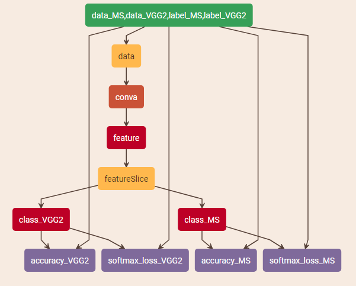
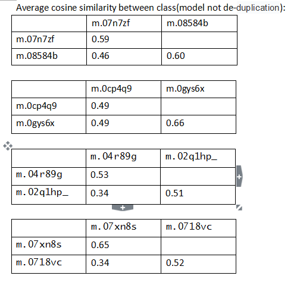
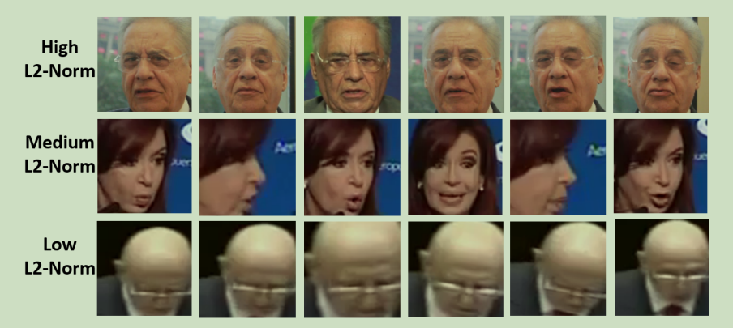

# Content

### <a herf="#1">1.Concat-Train of MS-Celeb-1M & VggFace2</a>

### <a herf="#2">2.Reduplicative id</a>

### <a herf="#3">3.Feature norm select</a>

### <a herf="#4">4.Hard example mining</a>

### <a herf="#5">5.Wrong example removal</a>

=================================================

### <a name="1">1.Concat-Train of Ms-celeb-1M & VggFace2</a>

Ms-celeb-1M and VggFace2 are both large scale open-dataset for face recognition.We all want to combine this two datasets as one trainning dataset,but there are a lot of reduplicative ids between two datasets.Simply concat this two dataset will only make the result worse.

Here we tried a concat network to solve this problem.The network is simplified as follow:

as the network show,Ms & Vggface2 share the same feature extract network but use different classification network.

sample prototxt is here:

[./concat_train/face_model.prototxt](./concat_train/face_model.prototxt)

### <a name="2">2.Reduplicative id</a>

Reduplicative id has been a serious problem in face recognition trainning.the network between and after de-reduplication will be much different.

we give a form to show that the trainning model is influnced by the reduplicative ids:

notice that m.07n7zf&m.08584b,m.0cp4q9&m.0gys6x,...,is the same person with different id.you can see that the similarity of intra class is abviously lower than similarity of inner class.which means the network has learning some feature to differ this two class apart,but that' wrong.

-------
Here has been some method such as comparing the example feature to remove the same person with different id in trainning set.

Here we try a method based on a non-de-duplicative network to remove the reduplicative id in trainning set,the python code can be find here:

[./de-duplication/redupliction_id_removing.py](./de-duplication/redupliction_id_removing.py) 

**Through the method**,we can get a reduplication id list between:

1)MS & Vggface2:[./de-duplication/reduplicton_name_VGG2MS.txt](./de-duplication/reduplicton_name_VGG2MS.txt)

2)Ms & MS:[./de-duplication/reduplicton_id_name_MS.txt](./de-duplication/reduplicton_id_name_MS.txt)

As the list is given automatically,so there might be some wrong pairs.

-------
**By the way**,we didn't use full of Ms 100K id and vggface2 9k id.
the class that we use will be found here:

Ms: [./de-duplication/class_map_MS](./de-duplication/class_map_MS) && [./de-duplication/class_map_MS20k](./de-duplication/class_map_MS20k)

vggface2: [./de-duplication/class_map_vgg2](./de-duplication/class_map_MS20k)

so if you want to get the whole reduplicative ids you need to apply this method on full ms&vgg2 dataset.

------
PS:To compare the similarity of weights of classification layer,you should use **sphereface(MarginInnerProdunct)** to make sure that the bias-term is ignored.

### <a name="3">3.Feature norm select</a>

About the feature norm,There is a lot to say.

----

First let's see a picture in "L2-constrained Softmax Loss for Discriminative Face Verification.(arXiv:1703.09507v3)"

which shows the l2-norm is positive correlated with image quality.

------

How about sphereface?we give a form:

this model is trainning on vggface2 with sphereface of lambda_min = 1

so when feature norm is large,the image is more like a face,when the feature norm is small,it is hard for people to distinct whether it is a face.

---------

There is a simple questions to help you understand the meanning of feature norm:

1.what does 0 feature norm mean?

2.what's the probability and softmax loss when feature norm is 0?

If you can answer this two questions.that will be fine.

-----------

So there is a deeper question:Do we really need these low-feature-norm images?

### <a name="4">4.Hard example mining</a>

### <a name="5">5.wrong example removal</a>
